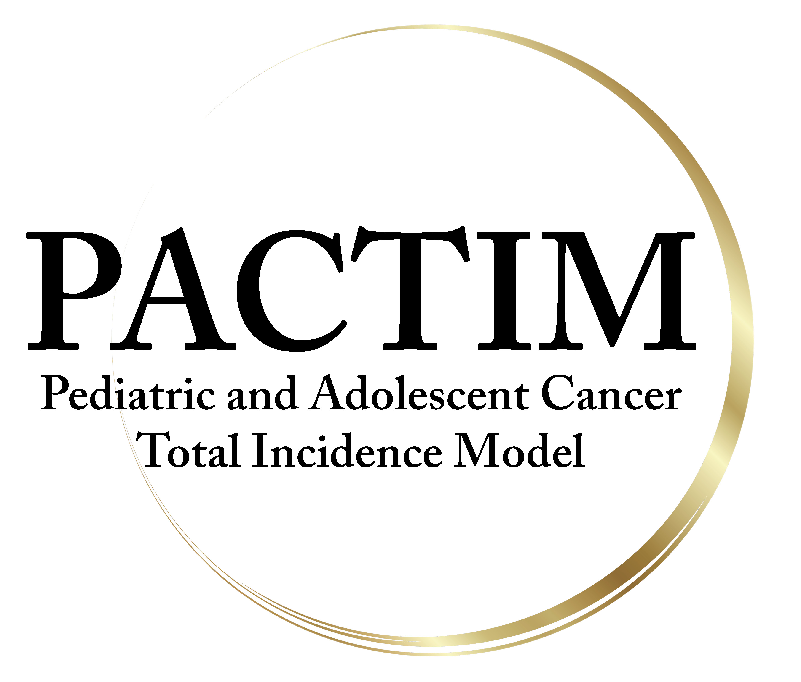
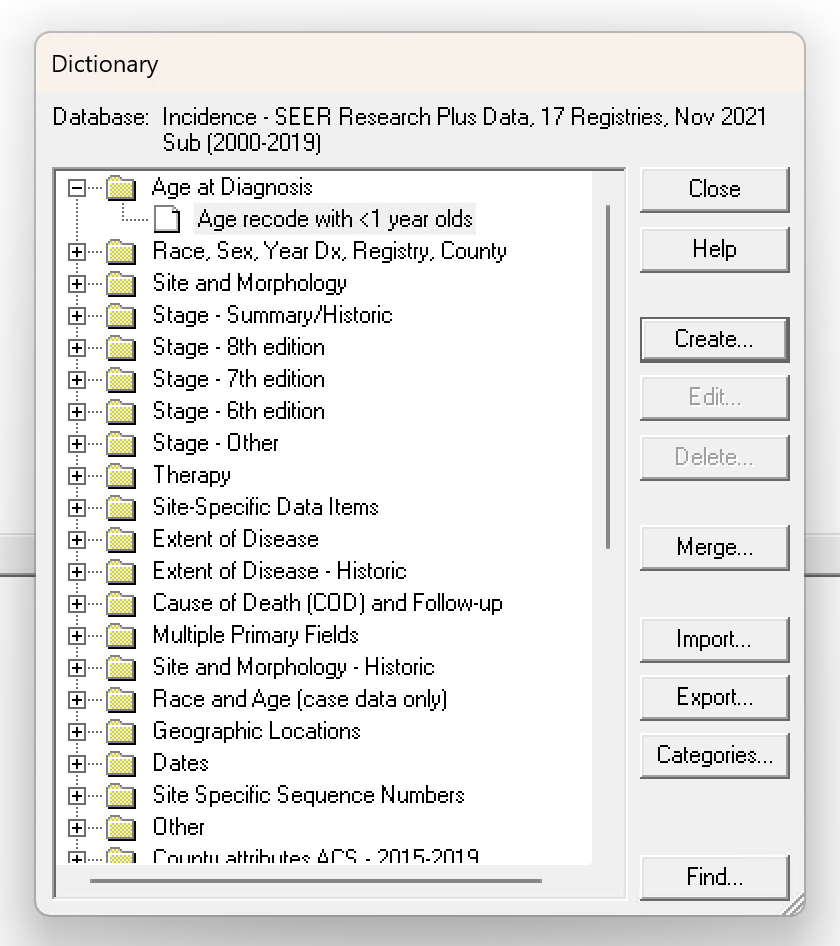
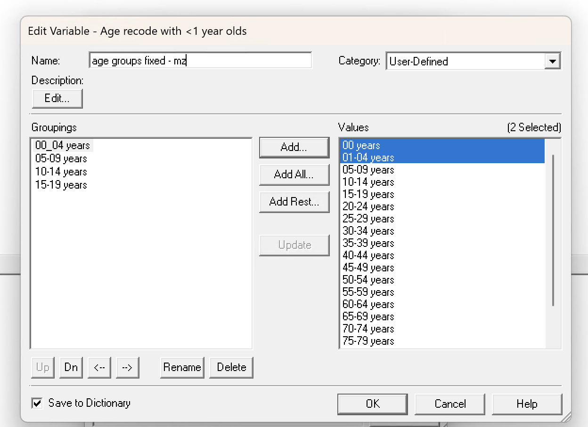
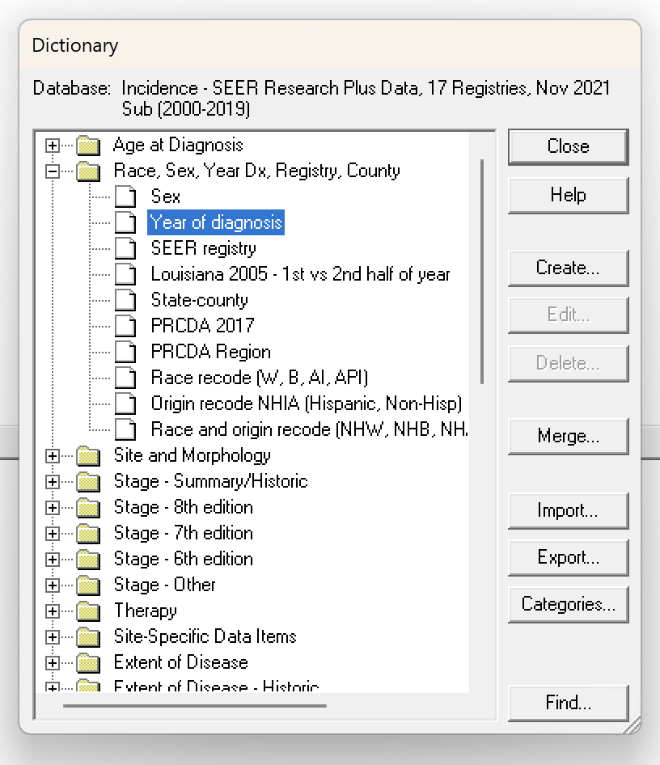
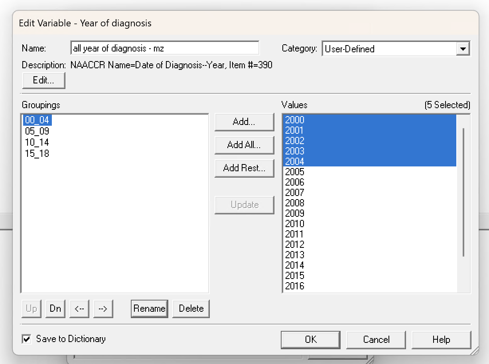
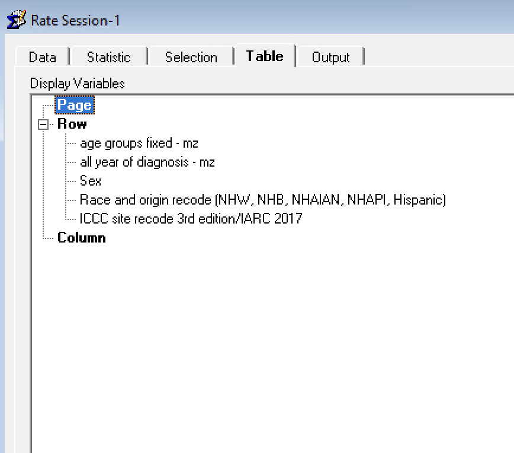

# PACTIM Code Repository

This repository contains the code to develop the Pediatric & Adolescent Cancer Total Incidence Model (PACTIM) from the raw data. Helper functions to produce predictions from the PACTIM are also provided.

Please go to <https://mzobeck.shinyapps.io/pactim_app> to access a Shiny web application to make predictions with PACTIM (July 2024 update: currently a demo website while under peer review).

For a full explanation of PACTIM and its performance parameters for predicting pediatric and adolescent cancer incidence, please see the primary manuscript: [forthcoming].

# Summary of Steps

1.  Fork or download this repository. The folder structure is important for the scripts to work without modification.
2.  Download the data training data from SEER\*Stat Software (see below for instructions). This step can be skipped if you wish to use the models without training them from scratch.
3.  Run the scripts in the `scripts` folder.
    -   `1_Make_Files` contains a script to train PACTIM (note: final models are already trained. The script may be skipped if you just wish to use the final models, which are available in the `models` folder.

    -   `2_Helpers` contains scripts for two helper functions that make it easier to produce predictions from PACTIM.

    -   `3_Example_Analysis` contains examples of how to produce predictions using the PACTIM and helper functions.

# A note on downloading the models

The file for the PACTIM subgroup models is too large to host on GitHub. [This file may be downloaded here.](https://u.pcloud.link/publink/show?code=XZ7BqC0Zks1NEXNBJ3VPeHpY21ATn0Iremqy).

Download and save this file to the `models` folder for the scripts to run properly.

The models for total cancers and cancer groups are available in the `models` folder.

# How to obtain SEER data

PACTIM is trained on data from the Surveillance, Epidemiology, and End Results (SEER) Program, which cannot be released without authorization. To obtain the data, please follow these steps:

1.  Request access to SEER\*Stat Software: <https://seer.cancer.gov/data/access.html>.

2.  Open a new rate session in the SEER\*Stat Software.

3.  Select the "SEER Research Plus Data, 17 Registries, Nov 2021 Sub (2000-2019)" as a rate session.

    1.  Note: The PACTIM was trained on the data set "SEER Research Plus Data, 18 Registries, Nov 2020 Sub (2000-2018) - Linked To County Attributes - Total U.S., 1969-2019 Counties," which is no longer available in the most recent version of SEER. The Detroit registry, previously included in the 18 registry data set, is no longer available. While the overall case count in the 17 registry data set is slightly lower, the crude rates are largely the same.

4.  Under the Statistics tab, select Rates (Crude).

5.  Create two custom variables in the Table tab as shown below:

    i.  age groups fixed - mz

    

    
    

    

    
    

    ii. all year of diagnosis - mz

        

        
        

        

        
        

6.  Select the following variables in the Table tab:

7.  Execute the query and download the data. Place the data in the `data > raw > seer` folder.

    1.  Note: The dictionary from the original query is included in the `data > raw > seer` folder for your reference.

If there are any issues, please open an issue on GitHub or [email the authors](mailto:mark.zobeck@bcm.edu). 
